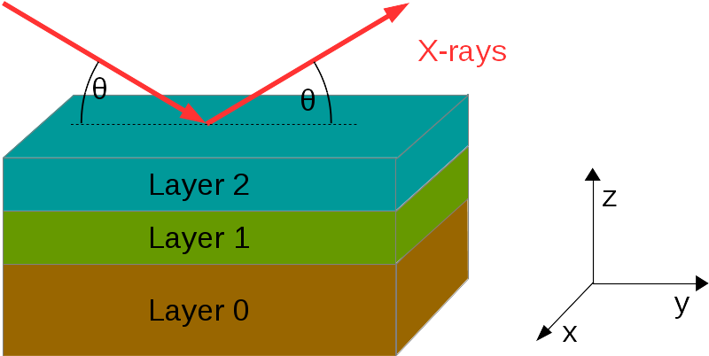

==============================
Geometry / Coordinate System
==============================

----------------------
Geometry of Experiment
----------------------
Within the PyXMRPackage following definitions for angles and stacking order are used:

    
The polarization vectors for :math:`\sigma`-polarization and :math:`\pi`-polarization are

.. math::
    \vec{e}_\sigma =    \left(\begin{array}{c} 1\\ 0\\ 0\\ \end{array}\right)   \quad \, \qquad   \vec{e}_\pi =    \left(\begin{array}{c} 0\\ \sin\theta\\ \cos\theta\\ \end{array}\right)
    
    
The polarization vectors for left and right circular polarizations are

.. math::
    \vec{e}_{\mathrm{left}} =    \frac{1}{2} \left(\begin{array}{c} 1\\ \mathrm{i} \sin \theta\\ \mathrm{i}\cos\theta\\ \end{array}\right)   \quad \, \qquad   \vec{e}_\mathrm{right} =   \frac{1}{2}  \left(\begin{array}{c} 1\\ -\mathrm{i}\sin\theta\\ - \mathrm{i}\cos\theta\\ \end{array}\right)

    
---------------
Magnetization
---------------
Some parts of PyXMRTool deal with magnetization inside of the sample (:class:`SampleRepresentation.MagneticFormfactor` and derived classes and :class:`SampleRepresentation.MagneticLayerObject`).
There, the direction of the magnetization is given by the angles :math:`\theta_M` and :math:`\phi_M`. The direction of the magnetization as vector :math:`\vec{b}` is connected to them in the following way:

.. math:: \vec{b}=\left(\begin{array}{c} \sin\theta_M sin\phi_M\\ \sin\theta_M \cos\phi_M\\ \cos\phi_M\\ \end{array}\right)

So :math:`\theta_M` is the angle between :math:`\vec{b}` and the z-direction. :math:`\phi_M` is the rotation from the scattering plane.